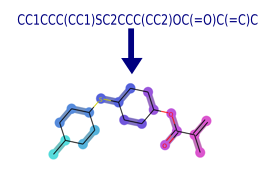

# Human-annotated Mappings (HAM) dataset


## Human-annotated Mapping (HAM) Dataset for Molecular Graph Partitioning

This dataset contains coarse-grained (CG) mappings of 1206 organic molecules with less than 25 heavy atoms. Each molecule was downloaded from the [PubChem database](https://pubchem.ncbi.nlm.nih.gov/) as **SMILES**. One molecule was assigned to two annotators to compare the human agreement between CG mappings. Downloaded SMILES  were hand-mapped using a [web-app](http://thewhitelab.org/Apps/cg-map/) developed by [The White Lab](http://thewhitelab.org/). The completed annotations were reviewed by a third person, to identify and remove unreasonable mappings (*eg: one bead mappings*) which did not agree with the given guidelines. Hence, there are 1.68 annotations per molecule in the current database (16\% removed). 


## Figures ##

Images of the generated mapping are given in the [figures](https://github.com/rochesterxugroup/HAM_dataset/tree/master/figures). These images were generated using [RDKit](https://www.rdkit.org/) software.


## Reference

```
@article{li_2020_chem_sci,
 author = {Li, Zhiheng and Wellawatte, Geemi P. and Chakraborty, Maghesree and Gandhi, Heta A and Xu, Chenliang and White, Andrew D.},
 journal = {Chemical Science},
 title = {Graph Neural Network Based Coarse-Grained Mapping Prediction},
 year = {2020}
}
```

